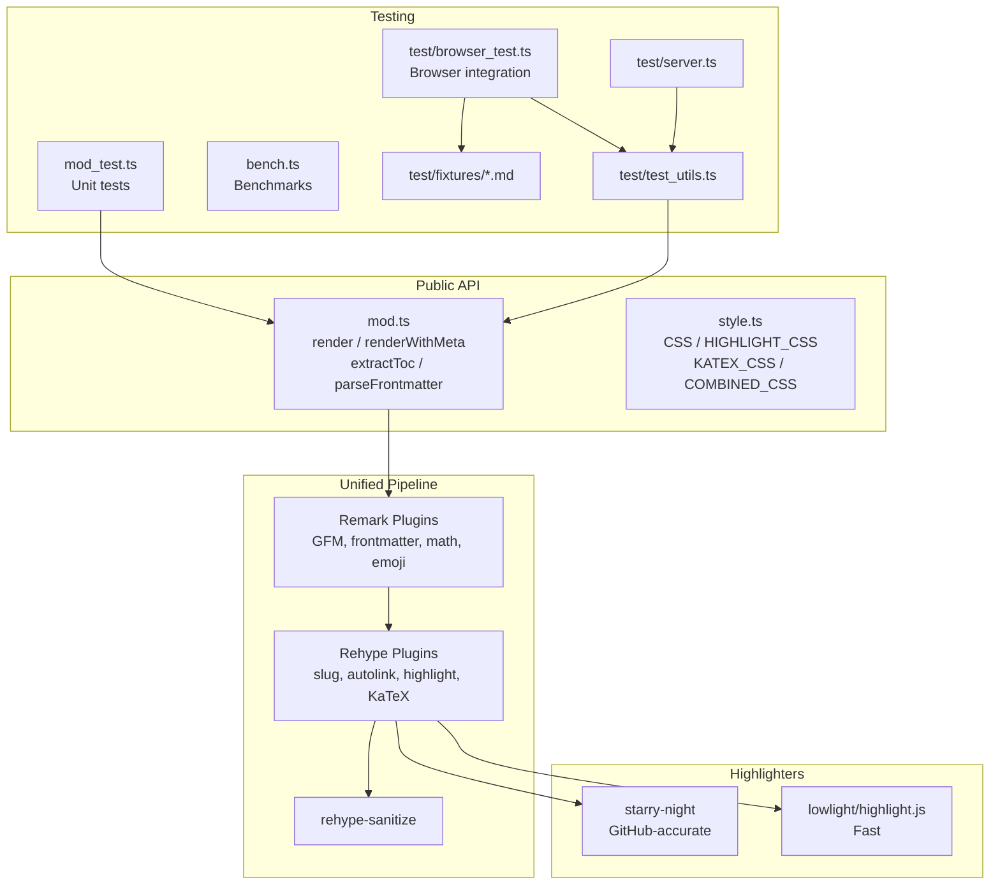
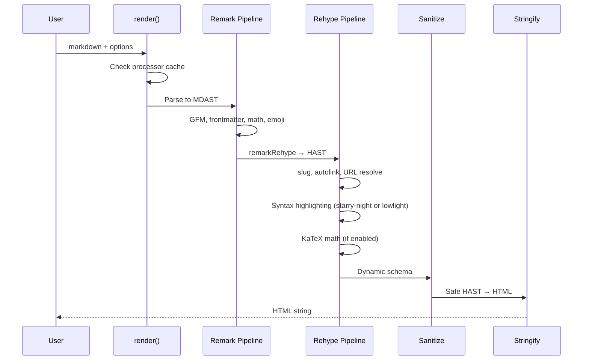

# Codebase Map

> Auto-generated by Cartographer. Last mapped: 2026-02-10

## System Overview

**@deer/gfm** is a GitHub Flavored Markdown rendering library for Deno, built on
the unified ecosystem. It transforms markdown to HTML with syntax highlighting,
math rendering, TOC extraction, and full GFM support.



## Directory Structure

```
.
├── mod.ts              # Core rendering engine and public API
├── style.ts            # CSS exports (GENERATED — do not edit)
├── mod_test.ts         # Comprehensive unit tests
├── bench.ts            # Performance benchmarks
├── deno.jsonc          # Deno config, import map, tasks
├── README.md           # Documentation
├── ROADMAP.md          # Future development plan
├── LICENSE             # MIT license
├── docs/
│   └── CODEBASE_MAP.md # This file
├── style/
│   ├── build.ts        # Style generation script (deno task gen:style)
│   └── build_test.ts   # Tests for style generation + CSS validation
├── test/
│   ├── test_utils.ts   # Shared browser test utilities
│   ├── browser_test.ts # Headless browser integration tests
│   ├── server.ts       # Dev server for manual testing
│   └── fixtures/
│       ├── code.md     # Syntax highlighting fixture
│       ├── gfm.md      # GFM features fixture
│       ├── math.md     # KaTeX math fixture
│       └── tables.md   # Table rendering fixture
└── .github/
    └── workflows/
        ├── ci.yml      # CI: format, lint, typecheck, test
        └── publish.yml # Manual JSR publish
```

## Module Guide

### mod.ts (Core Rendering Engine)

**Purpose**: Main module exporting all public rendering functions **Entry
point**: `@deer/gfm` (via deno.jsonc exports)

| Export                           | Purpose                                      |
| -------------------------------- | -------------------------------------------- |
| `render(markdown, opts)`         | Core HTML rendering                          |
| `renderWithMeta(markdown, opts)` | Render with TOC + frontmatter extraction     |
| `extractToc(markdown)`           | Lightweight TOC extraction (no full render)  |
| `parseFrontmatter(markdown)`     | Parse YAML frontmatter only                  |
| `clearCache()`                   | Evict all cached processors                  |
| `warmup(opts?)`                  | Pre-initialize a processor for given options |
| `Highlighter` type               | `"starry-night" \| "lowlight"`               |
| `RenderOptions` type             | Full options interface                       |
| `RenderResult` type              | Return type of renderWithMeta                |
| `TocEntry` type                  | `{ depth, text, slug }`                      |
| `PluginSpec` type                | Plugin or `[Plugin, ...opts]` tuple          |

**Dependencies**: unified, remark-parse, remark-gfm, remark-frontmatter,
remark-math, gemoji, remark-rehype, rehype-slug, rehype-autolink-headings,
rehype-sanitize, rehype-stringify, rehype-starry-night, rehype-highlight,
rehype-katex, hast-util-to-string, hast-util-heading-rank, unist-util-visit,
mdast-util-to-string, github-slugger, yaml

**Key patterns**:

- Builds unified processor pipeline dynamically based on options
- Processors cached by JSON-stringified options (disabled with custom plugins)
- LRU cache eviction at 10 entries using `Map` insertion-order semantics
- Starry-night lazy-loaded via dynamic import
- Sanitization schema built dynamically based on enabled features
- Two internal plugins (`remarkExtractFrontmatter`, `rehypeExtractToc`) extract
  metadata to `vfile.data` during every render pass, enabling `renderWithMeta()`
  to work in a single pass

### style.ts (CSS Exports)

**Purpose**: Self-contained CSS strings for styling rendered markdown **Entry
point**: `@deer/gfm/style` (via deno.jsonc exports)

| Export          | Purpose                                                        |
| --------------- | -------------------------------------------------------------- |
| `CSS`           | Base GitHub markdown styles + starry-night syntax highlighting |
| `HIGHLIGHT_CSS` | Lowlight/highlight.js syntax highlighting                      |
| `KATEX_CSS`     | KaTeX math styles (fonts from CDN)                             |
| `COMBINED_CSS`  | All three concatenated                                         |

**Dependencies**: None (pure CSS strings)

**Key patterns**:

- Public theming via `--gfm-*` CSS custom properties (10 variables)
- `--gfm-*` variables remap to internal Primer `--fgColor-*`, `--bgColor-*`,
  `--borderColor-*` vars on `.markdown-body`
- Component styles for headings, links, code headers, images, GitHub alerts
- Light/dark mode via `data-color-mode`, `.dark` class, `prefers-color-scheme`
- All markdown styles scoped under `.markdown-body`
- Generated by `style/build.ts` — do not edit by hand

### mod_test.ts (Unit Tests)

**Purpose**: Comprehensive unit and edge-case tests for all rendering functions

**Key areas tested**: GFM features, sanitization, highlighters, math, emoji,
baseUrl resolution, custom plugins, TOC extraction, frontmatter parsing,
unicode, malformed input, large documents

**Pattern**: BDD-style with `describe()`/`it()` blocks

### bench.ts (Benchmarks)

**Purpose**: Performance benchmarks comparing highlighters across document sizes

**Groups**: Small, medium, large, code-heavy documents, render-vs-meta
**Baseline**: Lowlight (faster than starry-night)

### test/ (Test Infrastructure)

| File              | Purpose                                                   |
| ----------------- | --------------------------------------------------------- |
| `test_utils.ts`   | `browserTest()` helper, `startServer()`, fixture registry |
| `browser_test.ts` | Headless Chromium tests verifying DOM structure           |
| `server.ts`       | Dev server on port 8000 for manual testing                |
| `fixtures/*.md`   | Markdown samples for code, GFM, math, tables              |

## Data Flow



**renderWithMeta** reads metadata from `vfile.data` (populated by pipeline
plugins during the same render pass):

- **TOC**: `rehypeExtractToc` walks HAST headings after `rehypeSlug` adds IDs
- **Frontmatter**: `remarkExtractFrontmatter` finds the YAML node in MDAST

## Conventions

- **Runtime**: Deno 2.x, TypeScript (no build step)
- **Distribution**: JSR (`@deer/gfm`)
- **Dependencies**: npm packages via `npm:` specifier in deno.jsonc import map
- **Testing**: `deno test -A` for unit tests, Astral for browser tests
- **CI**: Format, lint, typecheck, test on push to main + PRs
- **Publishing**: Manual `workflow_dispatch` → `deno publish` to JSR
- **Type strategy**: Simplified `Pipeline` interface to avoid unified's complex
  generics
- **Security**: Sanitization on by default, dynamic schema per feature

## Gotchas

### Core Rendering

- Processor cache uses `JSON.stringify()` — object key order matters
- Cache is LRU with a cap of 10; oldest entry evicted when full
- `clearCache()` drops all entries; `warmup()` pre-creates a processor
- Emoji shortcodes enabled by default (opt-out with `allowEmoji: false`)
- `baseUrl` auto-appends trailing `/` if missing
- Custom plugins disable the processor cache
- Starry-night requires async initialization (lazy-loaded)

### URL Resolution

- Fragment URLs (`#section`) are preserved, not resolved
- Protocol-relative URLs (`//example.com`) are preserved
- Root-relative URLs use the baseUrl's origin

### Sanitization

- Schema is dynamically built based on options (`allowMath`, `allowIframes`)
- Heading `id` attributes are explicitly whitelisted
- Class patterns: `pl-*` (starry-night), `hljs-*` (lowlight), `katex-*`
- Task list `<input>` elements are explicitly allowed

### CSS

- `style.ts` is generated by `style/build.ts` — run `deno task gen:style`
- Public theming via `--gfm-*` CSS custom properties (override on `:root`)
- `--gfm-*` vars remap Primer internals on `.markdown-body` — no duplication
- KaTeX fonts loaded from jsdelivr CDN
- Multiple dark mode triggers (`data-color-mode`, `.dark`, media query)

### Testing

- All tests require `-A` (all permissions) flag
- Browser tests download Chromium on first run
- Test fixtures loaded synchronously at module import time
- Test server loads CSS from esm.sh CDN

### Markdown Parsing

- Frontmatter only supports YAML (not TOML or JSON)
- Footnotes are not supported by standard GFM
- Uses `github-slugger` for heading IDs (handles duplicates with `-1`, `-2`
  suffixes)

## Navigation Guide

**To add a new rendering option**: Update `RenderOptions` type and `render()`
pipeline in `mod.ts`, add tests in `mod_test.ts`

**To add a new remark/rehype plugin**: Add to the pipeline in `render()` in
`mod.ts`, update sanitization schema if needed, add tests

**To modify syntax highlighting**: The highlighter selection is in `mod.ts`
(conditional `rehypeStarryNight` / `rehypeHighlight`), CSS in `style.ts`

**To add a new test fixture**: Create `test/fixtures/<name>.md`, register in
`testCases` in `test/test_utils.ts`, add browser test in `test/browser_test.ts`

**To modify CSS/theming**: Edit `style/build.ts` (static CSS constants or
`build()` assembly), then run `deno task gen:style` to regenerate `style.ts`

**To publish a new version**: Bump version in `deno.jsonc`, trigger
`publish.yml` workflow manually
